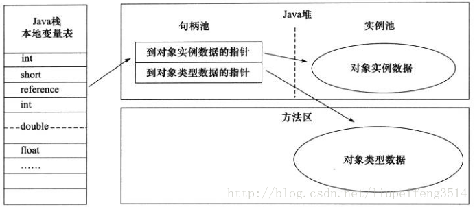
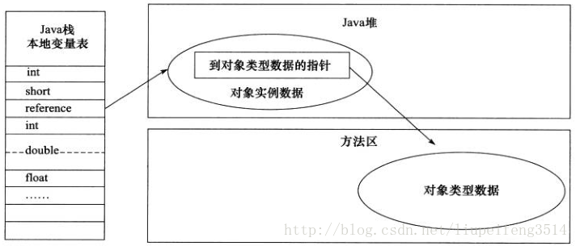

----
title: JVM如何定位到访问的对象
date: 2022-03-21
description: 

tags:
- 垃圾回收
- jvm
- Java

nav:
- Java

categories:
- Java 进阶

image: images/java/basic/java_logo.png

----
转载：https://blog.csdn.net/liupeifeng3514/article/details/79111651

Java程序需要通过栈上的reference数据来操作堆上的具体对象。由于在Java虚拟机规范里面只规定了reference类型是一个指向对象的引用，并没有定义这个引用应该通过什么种方式去定位、访问到堆中的对象的具体位置，所以对象访问方式也是取决于虚拟机实现而定的。主流的访问方式有使用`句柄`和`直接指针`两种。

## 使用句柄

使用句柄访问的话，Java堆中将会划分出一块内存来作为句柄池，reference中存储的就是对象的句柄地址，而句柄中包含了对象实例数据与类型数据的具体各自的地址信息。如下图所示：

## 直接指针

使用直接指针访问的话，Java堆对象的布局中就必须考虑如何放置访问类型数据的相关信息，reference中存储的直接就是对象地址，如下图所示：

这两种对象访问方式各有优势：

- 使用句柄来访问的最大好处就是reference中存储的是稳定句柄地址，在对象被移动（垃圾收集时移动对象是非常普遍的行为）时只会改变句柄中的实例数据指针，而reference本身不需要被修改。 

- 使用直接指针来访问最大的好处就是速度更快，它节省了一次指针定位的时间开销，由于对象访问的在Java中非常频繁，因此这类开销积小成多也是一项非常可观的执行成本。

从上一部分讲解的对象内存布局可以看出，就虚拟机HotSpot而言，它是使用第二种方式进行对象访问，但在整个软件开发的范围来看，各种 语言、框架中使用句柄来访问的情况也十分常见。
